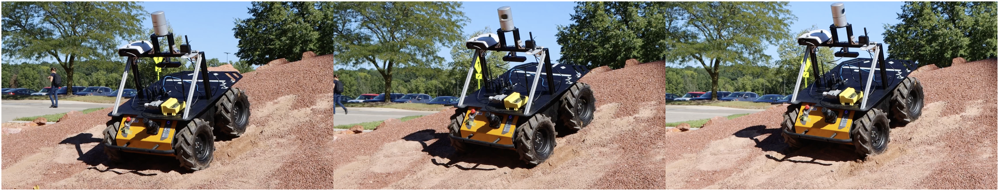
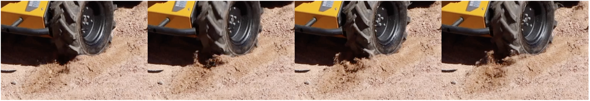
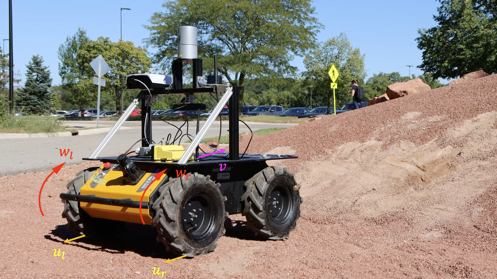
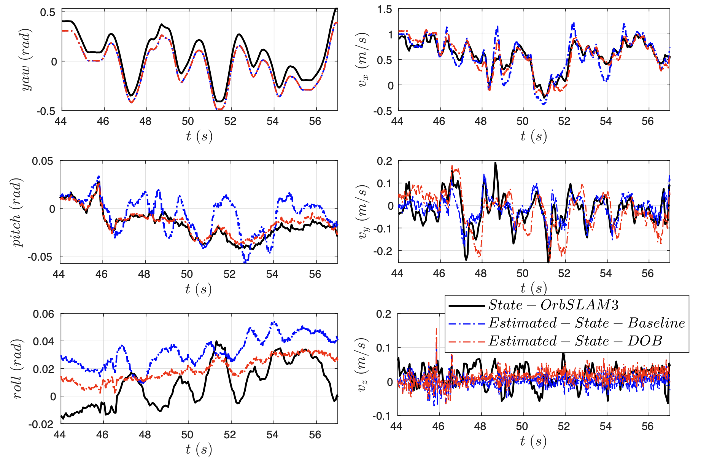
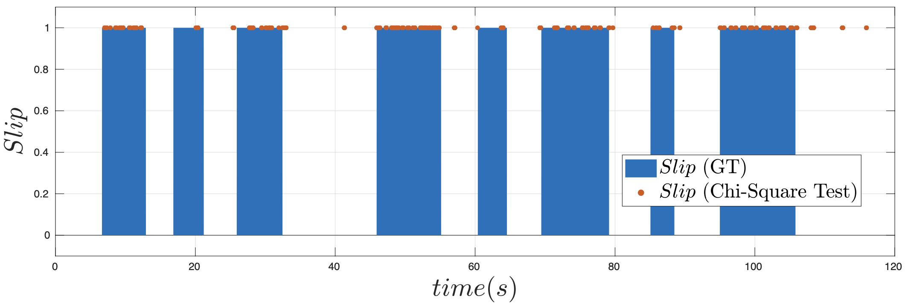

# Slip Detection (DOB)
This project introduces a novel slip estimator using Disturbance Observer(DOB). A rigorous model for invariant ovserver that estimate slipping veolcity is built on top of an Invariant Kalman Filter system for wheeled robot state estimation. The DOB-based method provides stable slip event observer on different deformable terrain.

<figure>
  
</figure>
<figure>
   
</figure>
<figure>
  
  <figcaption style="font-size:10pt; color:grey;text-align:justify;"><strong>Figure 1:</strong> Experimental wheeled robot platform Husky. The world frame W is a fixed frame. We define the body frame B as x pointing forward, y point to the left of the vehicle, and z derived from the right hand rule. We obtain angular velocity measurements ωl and ωr from the wheel encoders. Using an inertial measurement unit and wheel encoders measurements, the proposed method estimates the body velocity, slip velocity, robot orientation and position, visualized as v, u, R, and p, respectively.</figcaption>
</figure>

## Results

<figure>
   
  <figcaption style="font-size:10pt; color:grey;text-align:justify;"><strong>Figure 2: </strong>Yaw, pitch and roll angles of the main body are depicted in the
left three figures. Body Velocities are depicted in the right three figures.
Black: ground truth from ORB-SLAM3di system. Blue dashes: plain InEKF
without DOB. Red dashes: InEKF with DOB.</figcaption>
</figure>

<figure>
  
  <figcaption style="font-size:10pt; color:grey;text-align:justify;"><strong>Figure 3: </strong>Slip state estimation from sequence over slippery soap terrain. Red
dots: Detected slip event during which robot is slipping. Blue bar: Ground
truth during which robot is slipping.</figcaption>
</figure>


## Dependencies
* ROS
* Eigen3
* Boost

## Setup
1. This project is a ROS package. 
   
   To build to program, clone the project under `~/${PATH_TO}/catkin_ws/src` and follow the bellow commands:
```
cd ~/${PATH_TO}/catkin_ws/
catkin_make -j8
source devel/setup.bash
```
2. To run the program, you can use the following command:
```
roslaunch husky_inekf husky_estimator.launch
```

## Configuration
### Filter settings can be modified in `config/settings.yaml`:
#### **Input topics**

   * `imu_topics`: Input topics for IMU messages. (`sensor_msgs::Imu`).
  
   * `joint_topic`: Input topics for wheel encoders. (`sensor_msgs::JointState`).

#### **Velocity Modality**

The program support simultaneously correction from 3 different velocity topics. Each has a flag to enable/disable. If enable more than 1, the filter will be corrected sequentially when the message is received.

  * Wheel velocity correction. (`sensor_msgs::JointState`).
    
    **IMPORTANT:** This mode is necessary because DOB is developped based on this mode.

    * `enable_wheel_velocity_update`: Enable this will enable the velocity correction from wheel encoders. Please **do not** change this to false as DOB is built based on this input.
    
        The velocity is computed from: *v_body = (v_right_wheel + v_left_wheel)/2*, and  *v_wheel = angluar_velocity \* wheel_radius*.

    * `wheel_velocity_topic`: Topics for velocity input. (`sensor_msgs::JointState`).
  
    * `wheel_radius`: Wheel radius (m). 
  
    * `vehicle_track_width`: Distance between right and left wheel (m).

    * `vehicle_length`: 0.540 # distance between forward and back wheel centers (m).

  * Velocity from camera odometry. (`nav_msgs::Odometry`).
  
    * `enable_camera_velocity_update`: Enable this, the filter will take the difference between two pose and compute the velocity from it.
  
    * `camera_velocity_topic`: Topics for odometry input. (`nav_msgs::Odometry`)

  * Velocity from `geometry_msgs::TwistStamped`.
  
    * `enable_gps_velocity_update`: Enable this the filter will use velocity from the topic to correct the state.
  
    * `gps_velocity_topic`: Topic for the velocity input. (`geometry_msgs::TwistStamped`)

### **Filter Settings**

* `static_bias_initialization`: Enable static bias initialization using the first 250 measurements from IMU with the assumption of robot being static. If you disable this, remember to set the bias priors in `config/prior.yaml`. 
  
* `init_bias_using_orientation_est_from_imu`: Enable this the filter will use the orientation estimated from the imu to initialize bias. Setting this to false the filter will assume the robot to be horizontally static (gravity pointing downwards) to initialize the filter.  
  
* `velocity_time_threshold`: Threshold for time difference between the received velocity message and current time (sec). The message will be dropped if the time difference is larger than this threshold.

* `enable_friction_estimator`: [To be updated]

### **Frame Definition**

We assume the body frame to be at the imu position. (X pointing forward, Y to the left, Z pointing up.)
  * `rotation_body_imu`: Orientation from IMU to the body frame. Quaternion `[w,x,y,z]`.

  * `rotation_cam_imu`: Orientation from camera to the body frame. Quaternion `[w,x,y,z]`.
  
  * `translation_cam_imu`: Translation from camera to the body frame. `[x,y,z]`.

### **Logger**
We provide functions to log the estimated pose, velocity, and biases.

* `enable_pose_logger`: Enable this will write down the estimated pose, velocity, and biases in a txt file.
  
* `log_pose_skip`: Number of pose to be skipped while recording. Ex. Set to 100 the program will record every 100 poses.
  
* `inekf_pose_filename`: Path for the logged txt file in the [TUM format](https://vision.in.tum.de/data/datasets/rgbd-dataset/file_formats).
  
* `inekf_vel_est_file_name`: Path for the velocity log file.
  
* `inekf_bias_est_file_name`: Path for the bias log file.

We also provide toggles for input logger during your development:
* `enable_debug_logger`: debug logger toggle. **true** will log the following files. **false** is used is production.

* `inekf_vel_input_file_name`: Path for velocity input.

* `inekf_imu_file_name`: Path for imu input.
  
### **ROS pose publisher**
The following settings will be applied to ros publisher nodes:
* `enable_pose_publisher`: Toggle for publisher nodes. Setting to **true** stands for publish pose topic and path topic, while **false** will skip publisher nodes.

* `pose_topic`: The topic of pose publisher node.

* `path_topic`: The topic of path publisher node.

* `publish_rate`: Rate of publishing.

* `pose_skip`: number of poses to skip in path publisher node.

### Noise settings can be modified in `config/noise.yaml`:

* `gyroscope_std`: Set standard deviation for gyroscope input
* `accelerometer_std`: Set standard deviation for accelerometer input
* `gyroscope_bias_std`: Set standard deviation for gyroscope input bias
* `accelerometer_bias_std`: Set standard deviation for accelerometer input bias
* `wheel_vel_std`: Set standard deviation for wheel velocity mode
* `camera_vel_std`: Set standard deviation for camera velocity mode
* `gps_vel_std`: Set standard deviation for gps velocity mode
* `disturbance_std`: Set standard deviation for disturbance, this will affect slip detector DOB.

## Visualize InEKF in Rviz
1. Start running the husky estimator using the instructions above
2. Enter `rviz` in the terminal
2. Select `Add by topic` setting and select path
3. Changed fixed frame to the same value as `map_frame_id` in `config/settings.yaml`
4. The robot pose should begin being drawn in rviz
